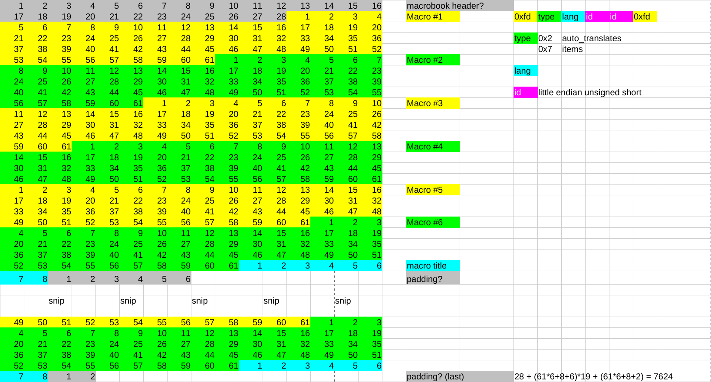

# print\_macrobook

[https://hamham-fenrir.github.io/macroweb/](https://hamham-fenrir.github.io/macroweb/)のためのマクロブックをYAML化するスクリプト

## ファイルフォーマット

mcrX.dat ファイルが装備セット用のファイルです。

* 先頭28バイト(ヘッダ?)
* 以下、マクロパレット20個分
    * 以下、マクロ1個分
        * 61バイト: マクロ1行分 x 6行
        * 8バイト: マクロタイトル
        * 6バイト: パディング？（最後だけ2バイト）

28 + (61 * 6 + 8 + 6) * 19 +  (61 * 6 + 8 + 2) = 7624 バイト

マクロは固定長レコードで管理されているため、1行の文字数を増やしたり、6行から増やしたりは難しいと思われます。行数を増やせないのはこの管理方法の制限だけでなく、マクロの処理が追いつかなくなる可能性もあるんじゃないかなぁ…。

## TAB補完の処理

`0xfd` から `0xfd` の間の4バイトで管理しているようです。

* 1バイト : TAB補完タイプ（後述）
* 1バイト : 日英どちらか
* 2バイト : ID (little endian unsigned short)

### TAB補完タイプ

* 0x2 : 定型文
* 0x7 : アイテム

## 補記

ほとんど[ChatGPT](https://chatgpt.com/)で作成しました。
